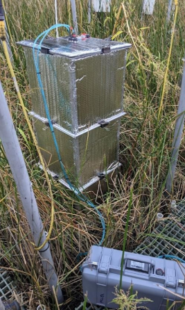
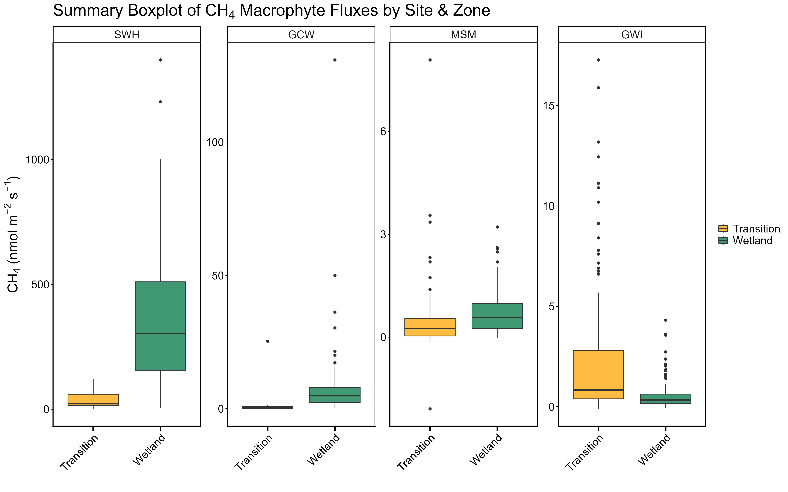
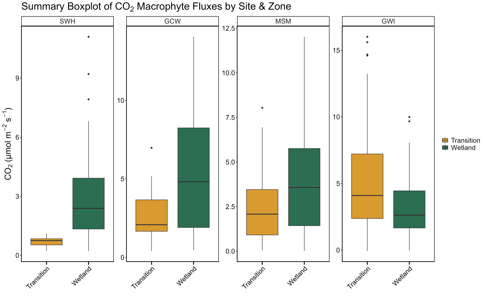
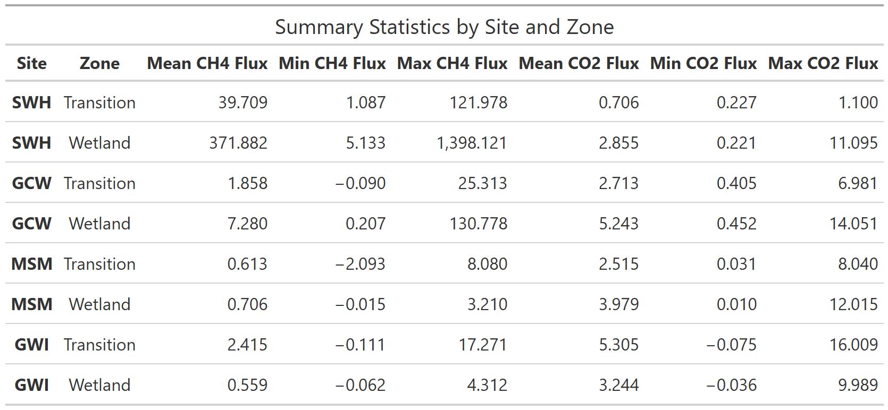
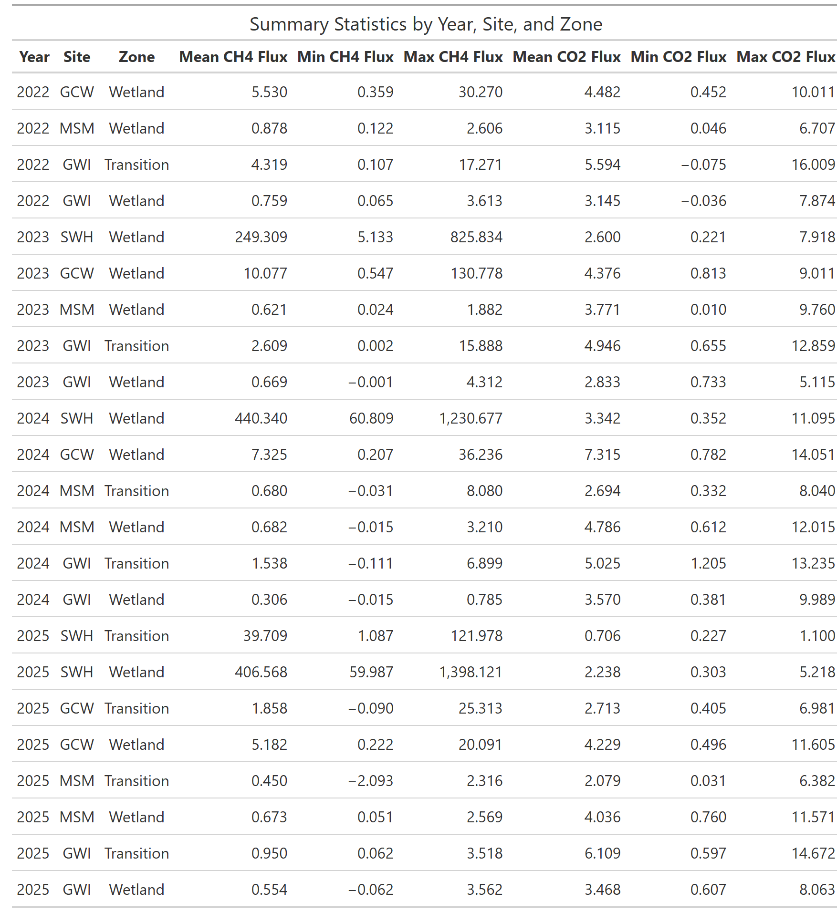

**Project: COMPASS - Synoptic Chesapeake Bay** 

Data Type: Macrophyte Chamber Greenhouse Gas Flux Measurements (Plants + Soil)

Sampling Type: Greenhouse gas fluxes

Sampling Locations: COMPASS Synoptic Sites: GCW, GWI, MSM, SWH

 

These data are not yet on ESSDIVE. A link will be put here following submission. 

 

**Data Description:** 
These data are greenhouse gas fluxes collected from dedicated collars at the COMPASS 'synoptic' sites in the Chesapeake Bay region: GCReW (GCW), Goodwin Islands (GWI), Moneystump Swamp (MSM), and Sweet Hall Marsh (SWH). The dedicated macrophyte collars were installed in 2022, five in each wetland and then later five in the transition zones. These flux collars allow for measurements of fluxes with both the soil and the macrophyte plants included in the chamber measurement. Five minute long fluxes were collected monthly from ~May-November for two years at each site then measurement frequency was decreased to every other month beginning in May and ending in November. Greenhouse gas concentrations (CH4, CO2) were measured with a LICOR 7810 gas analyzer and fluxes were estimated using the fluxfinder package. The field protocol can be found here: https://docs.google.com/document/d/1k-wOje2M8j5qZr_yTHb3n2Eff13eGSsA/edit?usp=sharing&ouid=108994740386869376571&rtpof=true&sd=true

 

Please see the Collate Data Summary PDF for a full overview of the data, but a high level summary is shown here: 

 

Fluxes were measured monthly from May to November at each site during 2022 and 2023. After the start of 2024, fluxes were measured every other month from May to November.

Samples were labeled as:  SiteCode_Zone_Replicate_YYYYMM (ex. GCW_TR_1_202506) 

For questions about this data: contact Stephanie J. Wilson (wilsonsj@si.edu) or Patrick Megonigal (megonigalp@si.edu). 