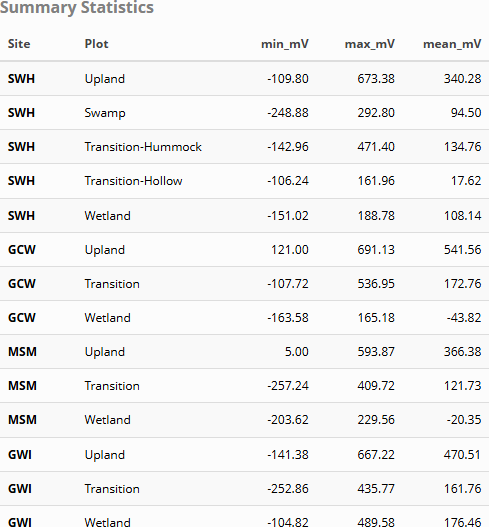

```{r setup, include=FALSE}
library(dplyr)
library(ggplot2)
library(ggpubr)
library(stringr)
library(readxl)
library(tidyr)
library(tibble)
library(openxlsx)
library(knitr)
```

##Grab 2022-2025 Processed Data Files
```{r Pull in 2022-2024 data files, message=FALSE, include=FALSE}

#read in 2022 Dionex Data:
dat22 <- read.csv("2022/Processed Data/COMPASS_Synoptic_CB_Redox_2022_processed.csv")
# head(dat22)
colnames(dat22)

#read in 2023 Dionex Data:
dat23 <- read.csv("2023/Processed Data/COMPASS_Synoptic_CB_Redox_2023_processed.csv")
# head(dat23)
colnames(dat23)

#read in 2024 Dionex Data:
dat24 <- read.csv("2024/Processed Data/COMPASS_Synoptic_CB_Redox_2024_processed.csv")
# head(dat24)
colnames(dat24)

#read in 2025 Dionex Data:
dat25 <- read.csv("2025/Processed Data/COMPASS_Synoptic_CB_Redox_2025_processed.csv")
# head(dat25)
colnames(dat25)

all_dat <- bind_rows(dat22, dat23, dat24, dat25)

all_dat <- all_dat %>%
  mutate(Project = "COMPASS:Synoptic", 
         Region = "CB", 
         Zone_1 = Zone) %>%
  mutate(Plot = case_when(Zone_1 == "Upland" ~ "UP", 
                          Zone_1 == "Transition" ~ "TR", 
                          Zone_1 == "Wetland" ~ "WC", 
                          Zone_1 == "Swamp" ~ "SWAMP",
                          TRUE ~ Zone)) %>% 
  filter (!is.na(Avg_mV))  ##remove NA values from samples not taken

final_dat <- all_dat %>%
  select (-Zone_1)

##Set 4 decimal points max
final_dat <- final_dat %>%
  mutate(across(where(is.numeric), round, digits = 1)) ##This does make all salinities 0 when Cl_ppm is 0 instead of 0.000026

##Format data
final_dat1 <- final_dat %>% 
  mutate(Project = "COMPASS: Synoptic", 
         Region = "CB", 
         Month_long = Month) %>% 
  mutate(Month = match(Month_long, month.name)) %>% 
  rename(Day = Date) %>% 
  select(c("Project", "Region", "Year", "Month", "Day", "Time_24hr",  "Time_Zone", "Site", "Plot", "Topography", "Depth", "Avg_mV", "Std_dv", "Std_err", "Notes"))

```


##Clean field notes
```{r}

unique(final_dat1$Notes)

final_dat2 <- final_dat1 %>%
  mutate(Notes = case_when(
    str_detect(Notes, "UP too dry") ~ NA, 
    str_detect(Notes, "probe 3 mesured twice; must be a pocket") ~ "probe 3 measured twice; must be a pocket", 
    str_detect(Notes, "I feel like") ~ NA, 
    str_detect(Notes, "Couldn't get probes more than 10 cm into ground") ~ NA, 
    str_detect(Notes, "4|45 pos change") ~ "probe 4 measured at 45 cm", 
    str_detect(Notes, "5 mV measurement was done at 30 cm") ~ "probe 5 measurement was done at 30 cm", 
    str_detect(Notes, "WC very dry") ~ "Very dry", 
    Notes == "" ~ NA, 
    TRUE ~ Notes
  )) %>% 
  mutate(Notes = str_to_sentence(Notes))

unique(final_dat2$Notes)

```


##Write out files
```{r write out combined data and metadata, include=FALSE}

#write out a csv of all the data to the main folder: 
write.csv(final_dat2, "COMPASS_SynopticCB_Redox_AllData.csv", row.names = FALSE)

```


## Visualize Data by Plot   
```{r Visualize Data, echo=FALSE, warning=FALSE, message = FALSE, fig.width=16, fig.height=10, dpi = 500}

data_plotting <- all_dat %>% 
  mutate(Zone_1 = case_when(Site == "SWH" & Zone_1 == "Transition" & Topography == "Hummock" ~ "Transition-Hummock",
                            Site == "SWH" & Zone_1 == "Transition" & Topography == "Hollow" ~ "Transition-Hollow",
                            TRUE ~ Zone_1))

#Order by Zone from Upland to Surface Water
data_plotting$Zone_1 = factor(data_plotting$Zone_1, levels = c("Upland",  "Swamp", "Transition", "Transition-Hummock", "Transition-Hollow", "Wetland"))
data_plotting <- data_plotting[order(data_plotting$Zone_1), ]

#Order by Site from SWH, GCW, MSM, GWI order, which is oligohaline to polyhaline
data_plotting$Site = factor(data_plotting$Site, levels = c("SWH", "GCW", "MSM", "GWI"))
data_plotting <- data_plotting[order(data_plotting$Site), ]

#Plot samples to get a first look at concentrations (sanity check)
#group the data for plotting
data_plotting_all <- data_plotting %>%
  group_by(Site, Zone_1) %>%
  mutate(row_num = factor(row_number())) %>%  # create row_num as factor per group
  ungroup()

# data_plotting_all$Date <- as.Date(paste(data_plotting_all$Year, data_plotting_all$Month, data_plotting_all$Day, sep = "-"))


#Plot data and change colors based on Zone:
viz_redox_plot <- ggplot(data_plotting_all, aes(x = as.character(Year), y = Avg_mV, fill = Zone_1)) +
  geom_bar(stat = "identity", position = position_dodge2(preserve = "total")) +
  facet_grid( ~ Site, scales="free") +
  scale_fill_manual(values = c(
    "Upland" = "#20063B",
    "Swamp" = "darkgrey",
    "Transition" = "#FFBC42",
    "Transition-Hollow" = "darkorange",
    "Transition-Hummock" = "#FFBC42",
    "Wetland" = "#419973")) +
  theme_classic() +
  labs(x = " ", y = "Redox Potential (mV)", title = "Samples: Redox") +
  theme(
    panel.spacing = unit(.05, "lines"), 
    panel.border = element_rect(color = "black", fill = NA, linewidth = 1)) + 
  theme(text = element_text(size = 20))

viz_redox_plot

```


## Summarized data for Site and Zone 
```{r Summarize and Visualize Data, echo=FALSE, warning=FALSE, message = FALSE, fig.width=22, fig.height=8, dpi = 500}

##Make Date Column with just Year and Month for Sample ID
all_dat_dates <- data_plotting %>%
  mutate(Month_num = match(Month, month.name)) %>%
  mutate(
    YearMonth = if_else(
      Month_num < 10,
      # Modify the string:
      YearMonth <- paste(Year, Month_num, sep = "-0"), 
      YearMonth <- paste(Year, Month_num, sep = "-"), 
    )
  )

##Summarize SO4 and Cl by Date, Site, and Zone
Redox_avg <- all_dat_dates %>%
  group_by(Month, Year, Site, Zone_1) %>%
   dplyr::summarize(mean_mV = mean(Avg_mV, na.rm=TRUE), 
            YearMonth = first(YearMonth), 
            Date = first(Date))

# Concatenate with a day (e.g., "01" for the first day)
Redox_avg$Date <- paste(Redox_avg$YearMonth, Redox_avg$Date, sep = "-")

# Convert to Date object
Redox_avg$Date <- as.Date(Redox_avg$Date)

# Define the specific date breaks you want to display
specific_breaks <- as.Date(c("2022-01-01", "2023-01-01", "2024-01-01", "2025-01-01"))

viz_redox_plot_avgs <- ggplot(Redox_avg, aes(x = Date, y = mean_mV, color = Zone_1, group = Zone_1)) +
  geom_point(size = 3) + 
  # geom_errorbar(aes(ymin = mean_Cl - sd_Cl, ymax = mean_Cl + sd_Cl), width = 0.2) + 
  geom_line() + 
  facet_grid( ~ Site, scales="free_y") +
  scale_color_manual(values = c(
    "Upland" = "#20063B",
    "Swamp" = "darkgrey",
    "Transition" = "#FFBC42",
    "Transition-Hollow" = "darkorange",
    "Transition-Hummock" = "#FFBC42",
    "Wetland" = "#419973")) +
  theme_classic() +
  labs(x = "Date", y = "Redox Potential (mV)", title = "Samples: Redox\n (No std dev because values were averaged previously,\n so new std dev would be incorrect)") +
  theme(
    panel.spacing = unit(0.5, "lines"), 
    panel.border = element_rect(color = "black", fill = NA, linewidth = 1)) +
  # theme(axis.text.x = element_text(angle = 90, hjust = 0.5))+ 
  theme(text = element_text(size = 30))+
  scale_x_date(breaks = specific_breaks, date_labels = "%Y", expand = expansion(mult = c(0.18, 0.05)))+
  theme(axis.ticks.x = element_line(linewidth = 1))+
  theme(axis.ticks.length.x = unit(0.25, "cm"))

viz_redox_plot_avgs

```


## Summarized Data by Depth
```{r Summarize Data by Depth, echo=FALSE, warning=FALSE, message = FALSE, fig.width=22, fig.height=8, dpi = 500}

##Remove SW and calculate average and sd for each depth
Redox_avg <- all_dat_dates %>%
  group_by(Site, Zone_1, Depth) %>%
   dplyr::summarize(mean_mV = mean(Avg_mV, na.rm=TRUE))

viz_redox_plot_depth <- ggplot(Redox_avg, aes(x = as.numeric(Depth), y = mean_mV, color = Zone_1, group = Zone_1)) +
  geom_point(size = 3) + 
  # Zone_geom_errorbar(aes(ymin = mean_Cl - sd_Cl, ymax = mean_Cl + sd_Cl), width = 0.5, size = 1) + 
  geom_line(size = 1.5) + 
  facet_wrap( ~ Site, scales="free", nrow = 1) + 
  scale_color_manual(values = c(
    "Upland" = "#20063B",
    "Swamp" = "darkgrey",
    "Transition" = "#FFBC42",
    "Transition-Hollow" = "darkorange",
    "Transition-Hummock" = "#FFBC42",
    "Wetland" = "#419973")) +
  theme_classic() +
  #labs(x = "Depth (cm)", y = "Redox Potential (mV)", title = "Samples: Redox profiles across transects") +
  labs(x = "Depth (cm)", y = "Redox Potential (mV)", title = "Samples: Redox\n (No std dev because values were averaged previously,\n so new std dev would be incorrect)") +
  theme(text = element_text(size = 20))+
  coord_flip() + 
  scale_x_continuous(trans = "reverse") + 
  labs(color = "Zone") 

viz_redox_plot_depth

```

## Boxplot by depth
```{r Boxplot by depth, echo=FALSE, warning=FALSE, message = FALSE, fig.width=16, fig.height=10, dpi = 500}

##Remove SW
data_plotting_depth <- data_plotting %>%
  mutate(Depth_cm = factor(Depth, levels = c("45", "20", "10")))


#Plot data and change colors based on Zone:
viz_redox_depth <-  ggplot(data_plotting_depth, aes(x = Depth, y = Avg_mV, fill = Zone_1)) +
  geom_boxplot() +
  facet_wrap( ~ Site, scales="free", nrow = 1) +
  scale_fill_manual(values = c(
    "Upland" = "#20063B",
    "Swamp" = "darkgrey",
    "Transition" = "#FFBC42",
    "Transition-Hollow" = "darkorange",
    "Transition-Hummock" = "#FFBC42",
    "Wetland" = "#419973")) +
  theme_classic() +
  labs(x = "Depth (cm)", y = "Redox Potential (mV)", title = "Samples: Redox") +
  # theme(
  #   panel.spacing = unit(.05, "lines"), 
  #   panel.border = element_rect(color = "black", fill = NA, linewidth = 1))+ 
  theme(text = element_text(size = 30))+
  theme(axis.text.x = element_text(angle = 45, vjust = 1, hjust = 1))+ 
  coord_flip() 

viz_redox_depth

```

## Boxplot summary
```{r Overall Boxplot, echo=FALSE, warning=FALSE, message = FALSE, fig.width=16, fig.height=10, dpi = 300}


##Summarize SO4 and Cl by Date, Site, and Zone
viz_redox_boxplot <- ggplot(all_dat_dates, aes(x = Zone_1, y = Avg_mV, fill = Zone_1, group = Zone_1)) +
  geom_boxplot() + 
  facet_grid( ~ Site, scales = "free_x") +
  scale_x_discrete(drop = TRUE) +
  scale_fill_manual(values = c(
    "Upland" = "#20063B",
    "Swamp" = "darkgrey",
    "Transition" = "#FFBC42",
    "Transition-Hollow" = "darkorange",
    "Transition-Hummock" = "#FFBC42",
    "Wetland" = "#419973")) +
  theme_classic() +
  labs(x = " ", y = "Redox Potential (mV)", title = "Synoptic CB Porewater: Redox Potential") +
  theme(
    panel.spacing = unit(0.5, "lines"), 
    panel.border = element_rect(color = "black", fill = NA, linewidth = 1)) +
  theme(axis.text.x = element_text(angle = 45, vjust = 1, hjust = 1))+ 
  theme(text = element_text(size = 30))+
  theme(axis.ticks.x = element_line(linewidth = 1))+
  theme(axis.ticks.length.x = unit(0.25, "cm"))+ 
  #scale_x_discrete(labels = c("Upland", "Swamp", "Transition", "Wetland", "Surface Water"))+ 
  theme(legend.position = "none")

viz_redox_boxplot

# Save as a PNG
png("COMPASS_SynopticCB_Redox_alldata.png", width = 2000, height = 1200, res = 100) 
print(viz_redox_boxplot)  # For ggplot objects, use print()
dev.off() 

```

##Calculate summary metrics
```{r Additional summary metrics, include=FALSE, dpi = 300}
# It would also be great to add to our collation codes a summary chunk that will calculate value ranges, means, and standard deviations (and errors) for each site, zone, depth for each year; also for each site zone, depth overall; and for each site and zone overall so that we have some easy access to metrics. Was just thinking this might be helpful today when re-collating the DIC data.

colnames(all_dat)

##Metrics for each site, zone, depth for each year
summary_by_year <- data_plotting %>%
  group_by(Year, Site, Zone_1, Depth) %>%
   reframe(
     min_mV = min(Avg_mV, na.rm=TRUE),
     max_mV = max(Avg_mV, na.rm=TRUE), 
     mean_mV = mean(Avg_mV, na.rm=TRUE)) %>%
  mutate(across(where(is.numeric), round, digits = 4)) 

##Metrics for each site, zone, depth for all years
summary_all_years <- data_plotting %>%
  group_by(Site, Zone_1, Depth) %>%
   reframe(
     min_mV = min(Avg_mV, na.rm=TRUE),
     max_mV = max(Avg_mV, na.rm=TRUE), 
     mean_mV = mean(Avg_mV, na.rm=TRUE)) %>%
  mutate(across(where(is.numeric), round, digits = 4)) 

##Metrics for each site and zone for all depths and years
summary_all_depths_years <- data_plotting %>%
  group_by(Site, Zone_1) %>%
   reframe(
     min_mV = min(Avg_mV, na.rm=TRUE),
     max_mV = max(Avg_mV, na.rm=TRUE), 
     mean_mV = mean(Avg_mV, na.rm=TRUE)) %>%
  mutate(across(where(is.numeric), round, digits = 2)) %>%
  rename(Plot = Zone_1)

```

##Calculate number of samples 
```{r Number of samples, include=FALSE, dpi = 300}
#  I am thinking it might be cool to add to our porewater collation files a table at the end that has total number of samples then also some info about # of samples per zone, site, depth etc.

##Metrics for each year
sample_numbers_years <- data_plotting %>%
  group_by(Year) %>%
   reframe(
     Number_of_samples = n())

##Metrics for each site, zone, depth for all years
sample_numbers <- data_plotting %>%
  group_by(Site, Zone_1, Depth) %>%
   reframe(
     Number_of_samples = n())
     

```

## Summary Tables
```{r Summary table metrics, echo = FALSE, message = FALSE, out.width="100%"}

library(kableExtra)

summary_table <- kable(
  summary_all_depths_years[, c("Site", "Plot", "min_mV",	"max_mV", "mean_mV")],  
  format = "html",
  booktabs = TRUE,
  caption = "<b>Summary Statistics<b>"
) %>%
  kable_styling(
    bootstrap_options = c("striped", "hover"),
    font_size = 12, 
    full_width = FALSE, 
    position = "center"
  ) %>%
  row_spec(0, bold = TRUE) %>%   # header
  column_spec(1, bold = TRUE) %>%
  column_spec(1, width = "0.8in") %>%   # Site
  column_spec(2, width = "1.6in") %>%   # Zone
  column_spec(3:5, width = "0.9in")     # Numeric columns

#output file to png that will save the table as: COMPASS_SynopticCB_Redox_Summary_alldata.png
save_kable(summary_table, file = "COMPASS_SynopticCB_Redox_Summary_alldata.png")

#Print the PNG


```

## Number of Samples
```{r number of samples tables, echo = FALSE, message = FALSE, dpi = 100}

kable(
  sample_numbers_years[, c("Year", "Number_of_samples")],  
  format = "latex",
  booktabs = TRUE,
  caption = paste0("Total Samples: ", nrow(all_dat))
) %>%
  kable_styling(
    latex_options = c("hold_position", "striped", "scale_down"),
    font_size = 12
  ) %>%
  row_spec(0, bold = TRUE) %>%   # header
  column_spec(1, bold = TRUE)

```

```{r Number of Samples Barplots, echo=FALSE, warning=FALSE, message = FALSE, fig.width=16, fig.height=10, dpi = 300}

##Number of Samples Plots
sample_num_barplot <- ggplot(sample_numbers, aes(x = as.character(Depth), y = Number_of_samples, fill = Zone_1)) +
  geom_col(position = "dodge", color = "black", width = 0.75) + # 'color' adds a border to the bars
  facet_grid(~Site , scales = "free_x") +
  scale_x_discrete(drop = TRUE) +
  scale_fill_manual(values = c(
    "Upland" = "#20063B",
    "Swamp" = "darkgrey",
    "Transition" = "#FFBC42",
    "Transition-Hollow" = "darkorange",
    "Transition-Hummock" = "#FFBC42",
    "Wetland" = "#419973")) +
  theme_classic() +
  labs(x = "Depth (cm)", y = "Number of Samples", title = "Synoptic CB Manual Redox Probe Sample Numbers") +
  theme(
    panel.spacing = unit(0.5, "lines"),
    panel.border = element_rect(color = "black", fill = NA, linewidth = 1)) +
  theme(axis.text.x = element_text(angle = 45, vjust = 1, hjust = 1))+
  theme(text = element_text(size = 30))+
  theme(axis.ticks.x = element_line(linewidth = 1))+
  theme(axis.ticks.length.x = unit(0.25, "cm"))
  #scale_x_discrete(labels = c("Upland", "Swamp", "Transition", "Wetland", "Surface Water"))+
  # theme(legend.position = "none")

sample_num_barplot
```


```{#r write out summarized data, include=FALSE}

#write out a csv of all the data to the main folder: 
write.csv(summary_by_year, "COMPASS_SynopticCB_Redox_Summarized_By_Year.csv")


#write out a csv of the metadata associated with the data: 
write.csv(summary_all_years, "COMPASS_SynopticCB_Redox_Summarized_Years_Combined.csv")


#write out a csv of the metadata associated with the data: 
write.csv(summary_all_depths_years, "COMPASS_SynopticCB_Redox_Summarized_Years_and_Depths_Combined.csv")
```


