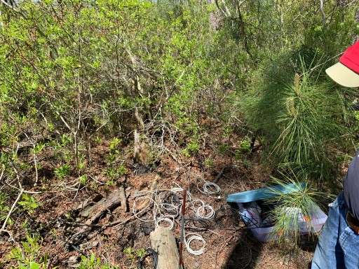
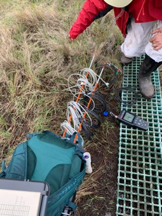
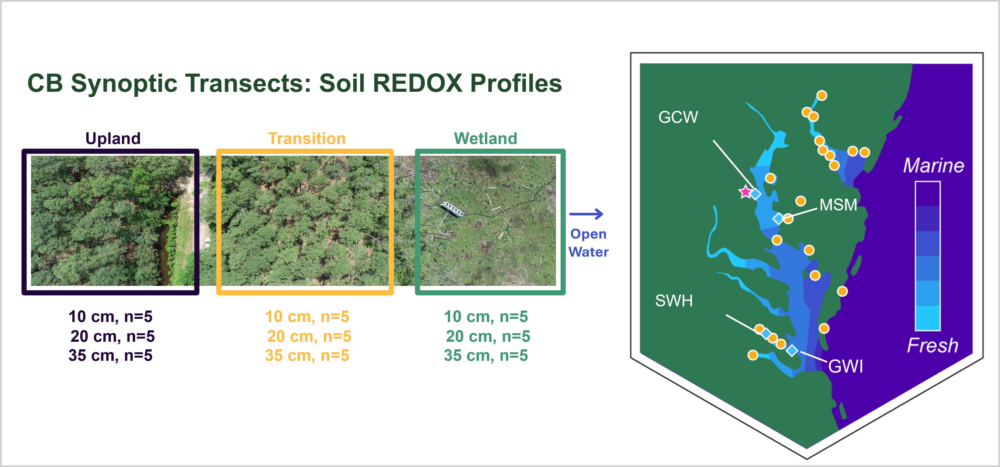
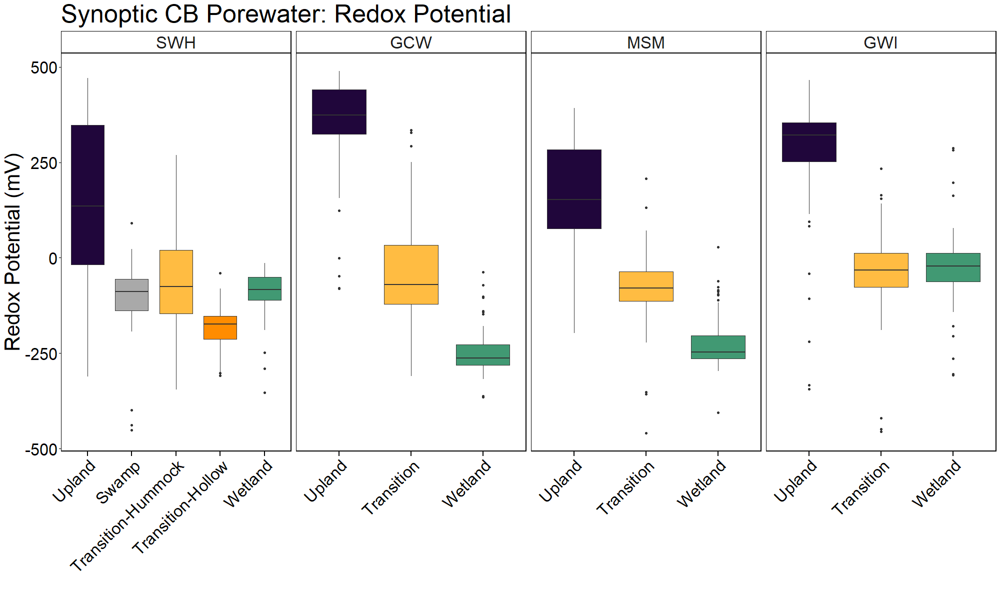

**Project: COMPASS - Synoptic Chesapeake Bay Soil Redox Profiles** 

Data Type: Manual Redox Probe Measurements (REDOX)

Sampling Type: Soil Redox Profiles

Sampling Locations: COMPASS Synoptic Sites: MSM, GWI, GCW, SWH 

 

Wilson S ; Phillips E ; Read Z ; Stearns A ; Megonigal J P (20XX): COMPASS-FME Synoptic Site Soil Redox Profiles (Manual Redox Probe). COMPASS-FME, ESS-DIVE repository. Dataset. doi:TBD accessed via Link TBD.

 

**Data Description:** 
 These data are measurements of soil reduction-oxidation potential (REDOX) profiles collected using REDOX probes at the COMPASS 'synoptic' sites in the Chesapeake Bay region:  GCReW (GCW), Goodwin Islands (GWI), Moneystump (MSM), and Sweet Hall (SWH), see site descriptions below. These sites have space for time transects spanning coastal upland forest (UP), coastal upland forest transitioning to wetland (TR), and wetland (WC) plots. The Sweet Hall Marsh site also has a forested swamp as part of its transect (SWAMP). Soil REDOX profiles were measured at 10, 20, and 30/35cm depths monthly from 2022-2024 then bi-monthly from 2025-present across the plots. The SWH TR site has variable topography that includes hummocks and hollows; these were measured separately and are denoted in the dataset by the Topography column as Hummock/Hollow. To make measurements, one Ag/AgCl saturated KCl reference electrode was pushed into the soil a few centimeters and six replicate soil REDOX probes were pushed into the soil to the depth of measurement and allowed to equilibrate for five minutes before recording the probe reading with a Thermo Scientific Orion pH/ORP handheld meter. After the reading, probes were pushed to the next depth of interest. Raw measurements were recorded then adjusted to account for the Ag/AgCl saturated KCl reference electrode used.

 

REDOX profiles were collected roughly from May to November at each site during 2022 and 2025. Sampling these was discontinued in 2025 due to the installation of continuous logging REDOX probes, which are included in the COMPASS Synoptic Sensor Data Releases. 

For questions about these data: contact Stephanie J. Wilson (wilsonsj@si.edu) or Patrick Megonigal (megonigalp@si.edu). 

 

  

 

**Data Files Available:** 

"COMPASS_SynopticCB_Redox_AllData.csv" = All data from all years. QAQC'd and collated.

"COMPASS_SynopticCB_Redox_Metadata.csv" = Metadata / Data dictionary for AllData file that defines each column header, units, and instrumentation.

**Overview Summary of Data**

  
 

**Site Location Descriptions**
GCReW (GCW); one of the COMPASS-FME synoptic sites, and has three plots: upland ('UP'; located at 38.8741N, 76.5522W), transition ('TR'; 38.8745, 76.5515W), and wetland ('WC'; 38.8750N, 76.5500W). Note that this site overlaps spatially with the TEMPEST (TMP) plots, the upland portion of the transect overlaps with the TEMPEST experiment control plot. This transect spans a mid- to late-successional (~80 years old) temperate, deciduous coastal forest and a mesohaline marsh along the Rhode River in Edgewater, MD.
  
Moneystump Swamp (MSM); one of the COMPASS-FME synoptic sites located in the Blackwater National Wildlife Refuge along the mesohaline Beaverdam Creek. This synoptic site consists of three plots: upland ('UP'; located at 38.4315N, 76.2267W), transition ('TR'; 38.4310N, 76.2277W), and wetland ('WC'; 38.4308N, 76.2286W). The site was established in June 2022. The transect spans a coastal loblolly pine forest and a mesohaline marsh dominated by Spartina and Distichlis.

Goodwin Islands (GWI); one of the COMPASS-FME synoptic sites, located along the polyhaline mouth of the York River, and has three plots: upland ('UP'; located at 37.2192N, 76.4087W), transition ('TR'; 37.2194N, 76.4092W), and wetland ('WC'; 37.2189N, 76.4101W). The site was established in June 2022. The transect spans a coastal loblolly pine forest, a transitional forest with a substantial phragmites stand, and a marsh dominated by Spartina and Distichlis. This site is also identified as a Chesapeake Bay National Research Reserve site.
  
Sweet Hall Marsh (SWH); one of the COMPASS-FME synoptic sites located along the tidal fresh Pamunkey River, one of the two tributaries of the York River in Virginia, USA. The COMPASS-FME consists of three plots: upland ('UP'; located at 37.5708N, 76.8954W), swamp ('SWAMP'; located at 37.57069N, 76.8957W), transition ('TR'; 37.56883N, 76.8964W), and wetland ('WC'; 37.56659N, 76.8970W). The synoptic site was established in June 2023. The transect spans a temperate, deciduous coastal forest, a forest swamp, and a tidal freshwater wetland dominated by peltandra, wild rice, and other species. This site is also identified as a Chesapeake Bay National Research Reserve site. 

