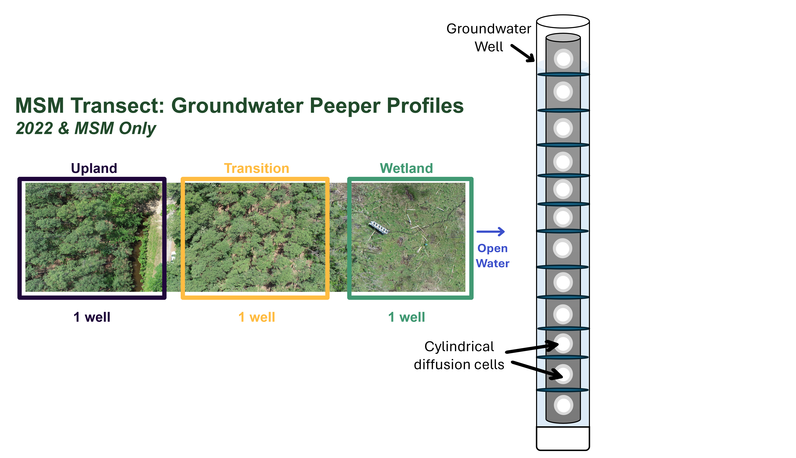
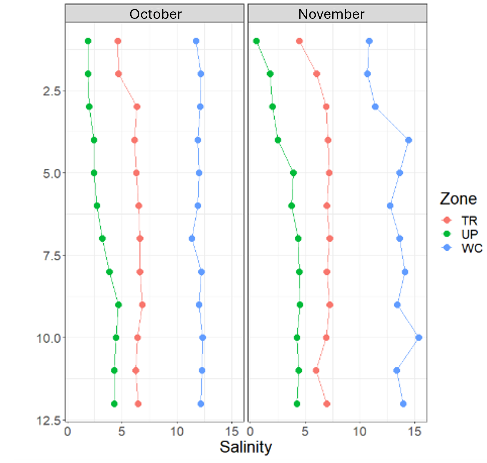
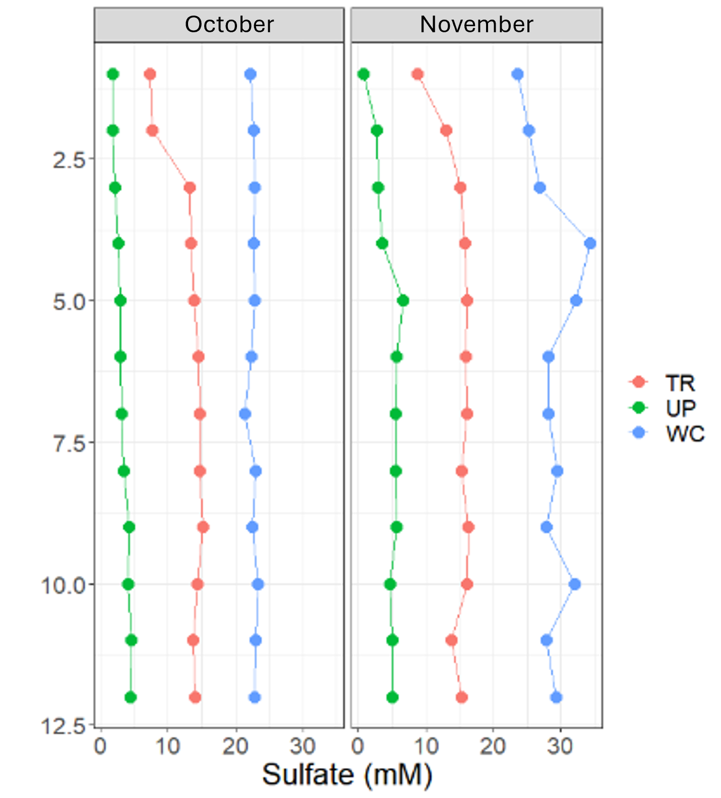

**Project: COMPASS - Synoptic Chesapeake Bay MSM Peeper Groundwater Well Profiles** 

Data Type: MSM Peeper Groundwater Well Profiles (Peepers)

Sampling Type: Peeper Groundwater Profiles

Sampling Locations: COMPASS Synoptic Sites: MSM 

 

Wilson S ; Fien E ; Phillips E ; Read Z ; Stearns A ; Ward N; Bailey V; Megonigal J P (20XX): COMPASS-FME Synoptic Site MSM Groundwater Peeper Well Profiles (Peeper Wells). COMPASS-FME, ESS-DIVE repository. Dataset. doi:TBD accessed via Link TBD.

 

**Data Description:** 
These data are measurements of depth resolved groundwater samples collected in 2022 from the COMPASS 'synoptic' site in the Chesapeake Bay region: Moneystump (MSM). This sites has space for time transects spanning coastal upland forest (UP), coastal upland forest transitioning to wetland (TR), and wetland (WC) plots. One groundwater well that extended from the top of the soil to 1 meter below the soil surface and made with slotted PVC for the entire length of that meter, were installed in each zone. In each well, a sampler comprised of a solid PVC rod fitted with 13 ml volume cylindrical diffusion cells capped with 0.2 micron nylon membranes at roughly 10cm increments were installed based on the design described by Groffman and Crossey (1999; https://doi.org/10.1016/S0009-2541(99)00119-9). Each depth is isolated in the well casing with a neoprene seal. The diffusion cells were filled with DI water prior to installation then collected and subsampled and aliquoted into vials to measure groundwater ion, sulfide, iron, and nutrient concentrations. 

There were only three peeper wells available for installation, we installed these at MSM because of the vegetation campaign happening that year. Sampling was discontinued due to incoming sample volumes that were too high to manage without a direct questin being answered by these data. 

  

 

Groundwater peeper profiles were collected roughly from at MSM during October and November of 2022 and April and June of 2023. Sampling these was discontinued after June 2023. 

For questions about these data: contact Stephanie J. Wilson (wilsonsj@si.edu) or Patrick Megonigal (megonigalp@si.edu). 

 

**Data Files Available:** 

"COMPASS_SynopticCB_Peeper_Data.csv" = All data from all years. QAQC'd and collated.

"COMPASS_SynopticCB_PeeperDataDictionary.csv" = Metadata / Data dictionary for AllData file that defines each column header, units, and instrumentation.

**Overview Summary of Data**

  
 
  
