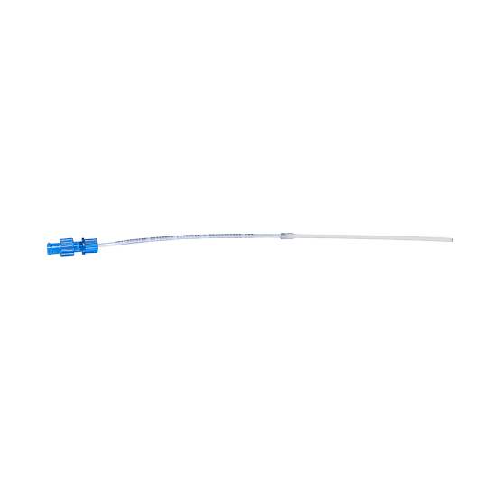
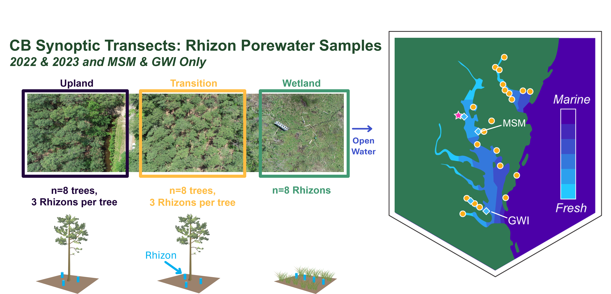
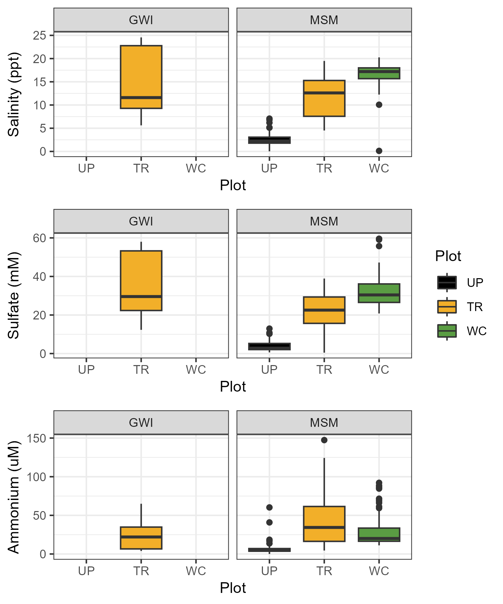
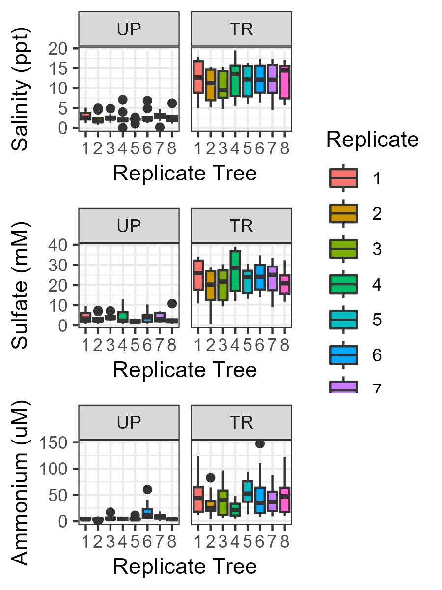

**Project: COMPASS - Synoptic Chesapeake Bay Rhizon Porewater Samples** 

Data Type: Rhizon Porewater Samples (Rhizons)

Sampling Type: Rhizon Porewater

Sampling Locations: COMPASS Synoptic Sites: MSM, GWI

 

Wilson S ; Erin F ; Phillips E ; Read Z ; Stearns A ; Bailey V ; Megonigal J P (20XX): COMPASS-FME Synoptic Site Rhizon porewater samples (Rhizons). COMPASS-FME, ESS-DIVE repository. Dataset. doi:TBD accessed via Link TBD.

 

**Data Description:** 
These data are measurements of shallow porewater samples collected in 2022 and 2023 from the COMPASS 'synoptic' site in the Chesapeake Bay region: Goodwin Islands (GWI) and Moneystump (MSM). These sites have space for time transects spanning coastal upland forest (UP), coastal upland forest transitioning to wetland (TR), and wetland (WC) plots. In the UP and TR transect locations, rhizon porewater (Rhizosphere Research Products: https://www.rhizosphere.com/rhizons/) samplers (n=3) were installed around Loblolly Pine (Pinus taeda) trees (n=8) one meter from the tree stem in a triangle formation. In the WC, replicate rhizons (n=8) were installed in a line next to other synoptic sampling infrastructure as there are no trees present in the WC. Rhizons were sampled monthly from roughly May-November in 2022 and 2023. A need was connected to the rhizon and then inserted into an evacuated exetainer to pull sample from the ground, the samplers were porous from 5-15cm deep. After collection in the exetainers, the three replicate samples from one tree were combined and aliquoted into vials to measure porewater ion, sulfide, iron, and nutrient concentrations. Only samples from the GWI TR were able to be collected, the other plot shallow soils were too dry or well drained.

 

Rhizon samples were collected roughly from May to November at MSM and GWI during 2022 and only at MSM monthly in 2023. Sampling these was discontinued after 2023 due to large sample volumes, which limited capacity to continue collecting these samples. 

For questions about these data: contact Stephanie J. Wilson (wilsonsj@si.edu) or Patrick Megonigal (megonigalp@si.edu). 

 

 

**Data Files Available:** 

"COMPASS_SynopticCB_Rhizon_Data.csv" = All data from all years. QAQC'd and collated.

"COMPASS_SynopticCB_Rhizon_Metadata.csv" = Metadata / Data dictionary for AllData file that defines each column header, units, and instrumentation.

**Overview Summary of Data**

  
 
  
