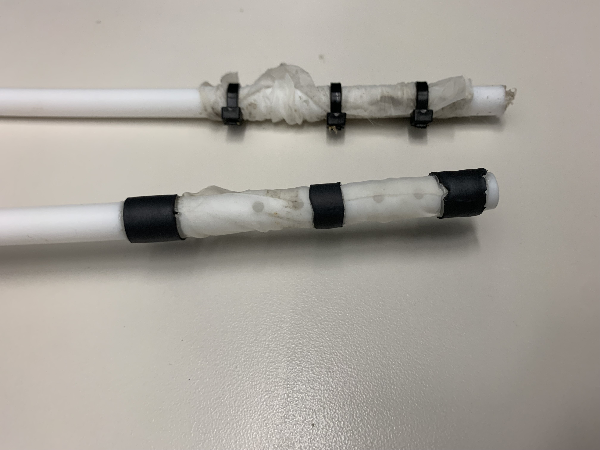
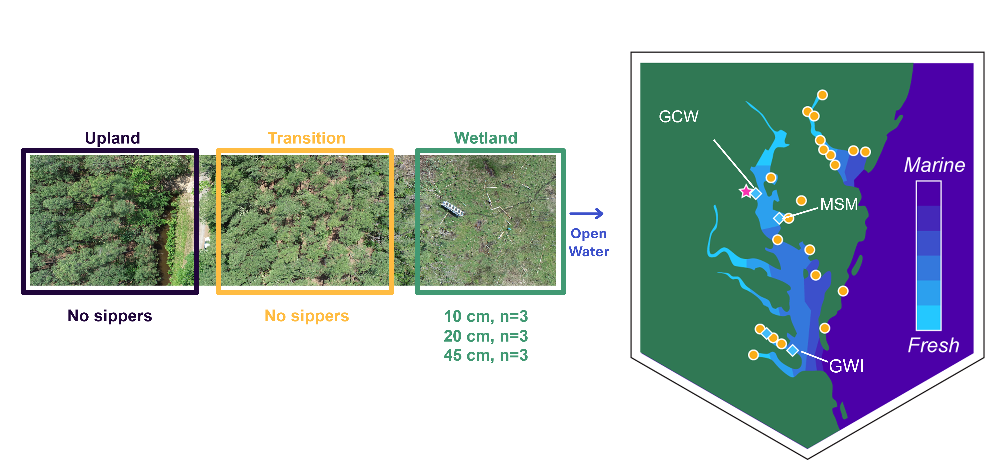
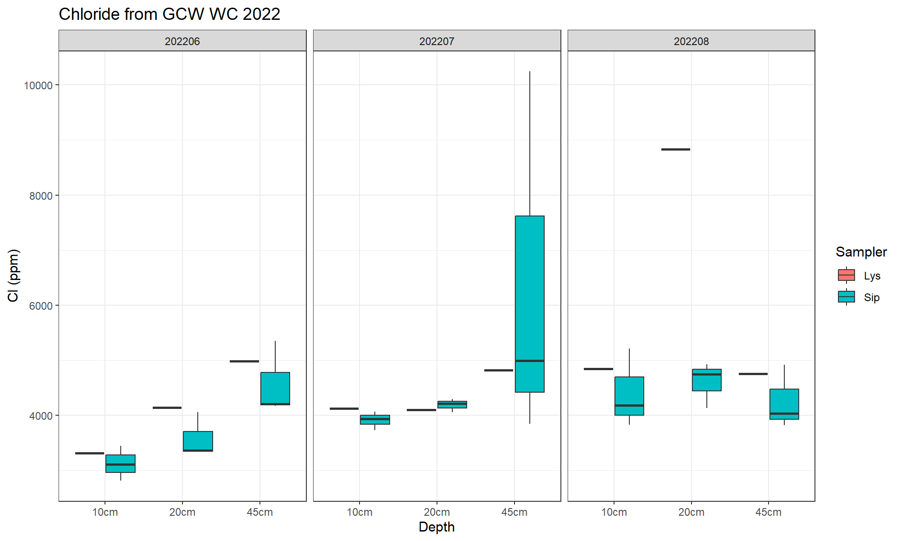
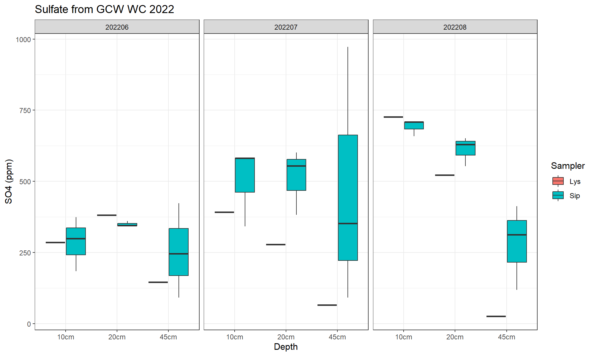

**Project: COMPASS - Synoptic Chesapeake Bay Wetland Porewater Sipper Profiles** 

Data Type: Porewater Sipper Sample Analysis (Sipper)

Sampling Type: Porewater Sipper Profiles

Sampling Locations: COMPASS Synoptic Sites: MSM, GWI, GCW (WC Only)

 

Wilson S ; Fien F; Phillips E ; Read Z ; Stearns A ; Bailey V; Megonigal J P (20XX): COMPASS-FME Synoptic Site Wetland Porewater Sipper Profiles. COMPASS-FME, ESS-DIVE repository. Dataset. doi:TBD accessed via Link TBD.

 

**Data Description:** 
These data are an analysis of porewater profiles collected using porewater sippers at the COMPASS 'synoptic' sites in the Chesapeake Bay region:  GCReW (GCW), Goodwin Islands (GWI), and Moneystump (MSM). These sites have space for time transects spanning coastal upland forest (UP), coastal upland forest transitioning to wetland (TR), and wetland (WC) plots. Porewater sippers were ONLY used in the Wetland plots during the first year of sampling (2022). These were then replaced with suction lysimeters in order to be consistent with porewater sampling methods in the UP and TR plots. Porewater was collected from sippers at 10, 20, and 45cm depths monthly in 2022 prior to being replaced with new infrastructure. Porewater samples were pulled from sippers in the wetland (WC) plot using a syringe and aliquoted into bottles for analysis of sulfate, chloride, sulfide, nutrient, and dissolved carbon concentrations. Analysis of each constituent is described in the data dictionary and further details, including quality assurance and quality control for all analyses can be found on the COMPASS GitHub page. 

 

REDOX profiles were collected roughly from May to November at the wetland of each site during 2022. Sampling these was discontinued after 2022 after the installation of suction lysimeters, which replaced the sippers and made sampling infrastructure across all transect locations the same (UP, TR, WC). Lysimeter porewater profiles are avaialble for the WC 2022 to present.  

For questions about these data: contact Stephanie J. Wilson (wilsonsj@si.edu) or Patrick Megonigal (megonigalp@si.edu). 

 

  

 

**Data Files Available:** 

"COMPASS_SynopticCB_Sipper_Data.csv" = All data from 2022. QAQC'd and collated.

"COMPASS_SynopticCB_Sipper_Metadata.csv" = Metadata / Data dictionary for AllData file that defines each column header, units, and instrumentation.

**Comparison of Lysimeter and Sipper Data collected at the same time**

  
 
  
