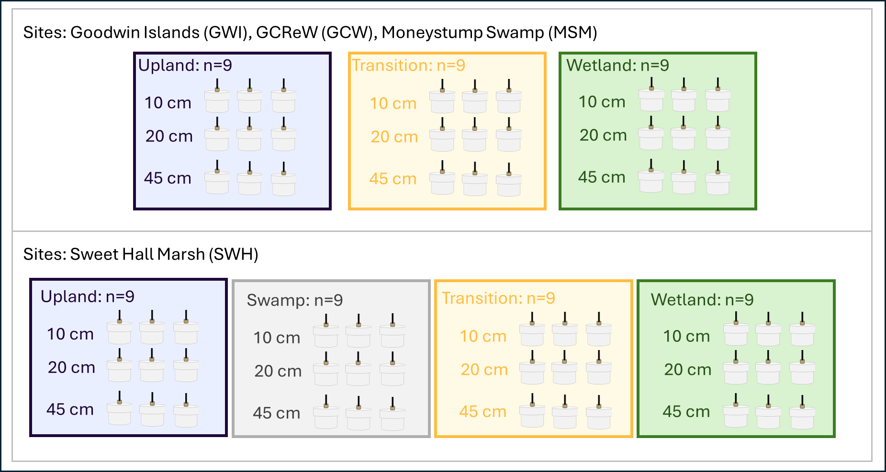

**Project: COMPASS - Synoptic Chesapeake Bay** 

Data Type: Soil Gas Well GHGs (SGAS)

Sampling Type: Greenhouse gas concentrations

Sampling Locations: COMPASS Synoptic Sites: MSM, GWI, GCW, SWH

 

**Data Description:** 
These data are soil greenhouse gas concentration profiles collected from soil gas wells at the COMPASS 'synoptic' sites in the Chesapeake Bay region: Moneystump Swamp (MSM), Goodwin Islands (GWI), GCReW (GCW), and the Sweet Hall Marsh (SWH). These sites have space for time transects spanning coastal upland forest (UP), coastal upland forest transitioning to wetland (TR), and wetlands (WC). The Sweet Hall Marsh site also has a forested swamp as part of its transect (SWAMP). In each zone, gas wells are installed at three depths in triplicate creating three profiles of 10, 20, and 45cm. In addition, an air sample is collected in each zone (0 cm). The samples are stored in exetainers then analyzed for methane and carbon dioxide on a Varian 450 Gas Chromatograph. The methane is determined with an FID and the carbon dioxide with a TCD.  

 

Gas samples were collected roughly from May to November at each site starting in 2023 and continuing to present. 

For questions about this data: contact Stephanie J. Wilson (wilsonsj@si.edu) or Patrick Megonigal (megonigalp@si.edu). 

 

  

 

**Data Files Available:** 

"COMPASS_SynopticCB_SGAS_AllData.csv" = All data from all years.QAQC'd and collated.

"COMPASS_SynopticCB_SGAS_Metadata.csv" = Metadata for AllData file that explains each column header, units, and instrumentation.
  

