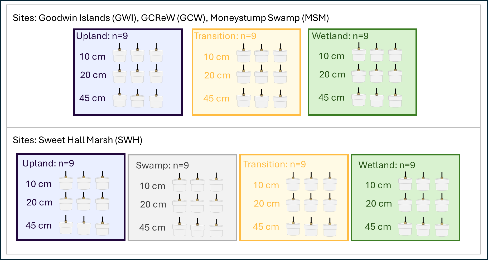
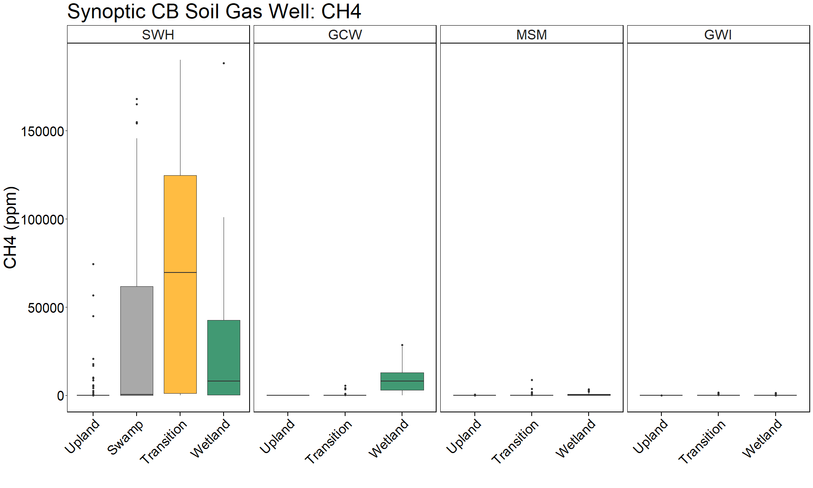
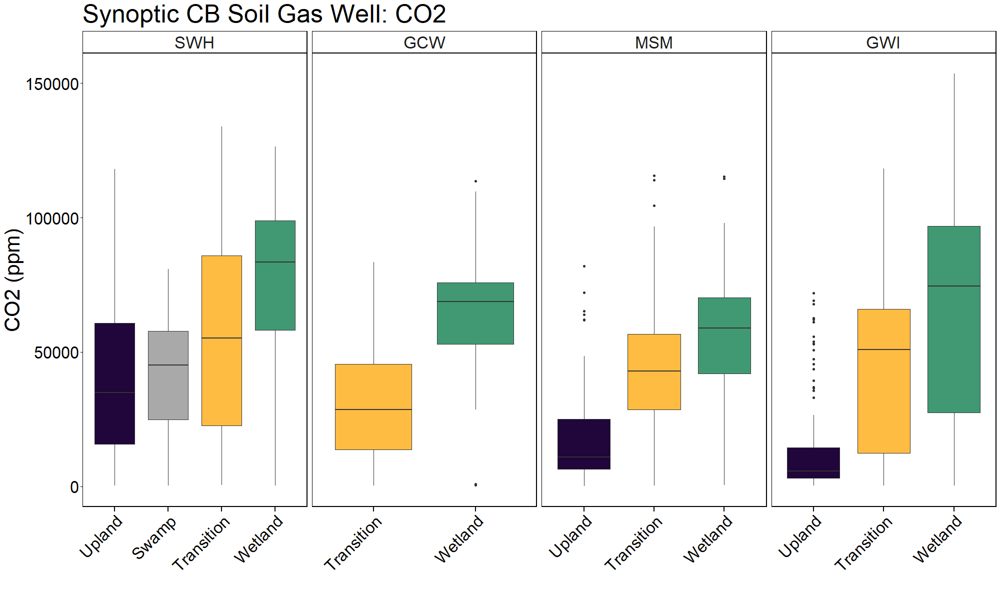
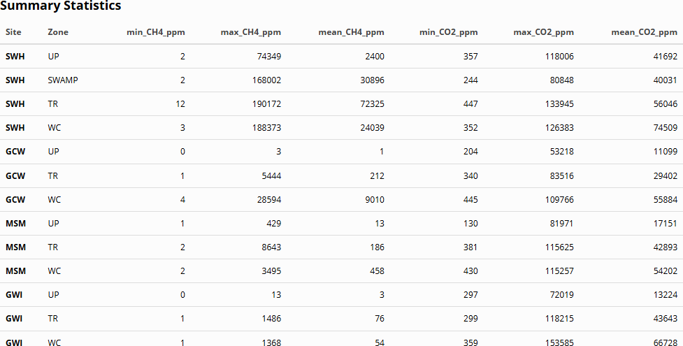

**Project: COMPASS - Synoptic Chesapeake Bay** 

Data Type: Soil Gas Well GHGs (SGAS)

Sampling Type: Trace gas concentrations

Sampling Locations: COMPASS Synoptic Sites: MSM, GWI, GCW, SWH

 

Wilson S ; Chin N; Fien E; Phillips E; Read Z; Stearns A; Wegner M; Megonigal J P (20XX): COMPASS-FME Synoptic Site Soil Trace Gas Profiles (Soil Gas Wells). COMPASS-FME, ESS-DIVE repository. Dataset. doi:TBD accessed via Link TBD.

 

**Data Description:** 
These data are profiles of trace gas (carbon dioxide and methane) concentrations collected from soil gas wells at the COMPASS 'synoptic' sites in the Chesapeake Bay region: Moneystump Swamp (MSM), Goodwin Islands (GWI), GCReW (GCW), and the Sweet Hall Marsh (SWH). These sites have space for time transects spanning coastal upland forest (UP), coastal upland forest transitioning to wetland (TR), and wetlands (WC). The Sweet Hall Marsh site also has a forested swamp as part of its transect (SWAMP). At the GCReW site, the upland zone overlaps with the COMPASS ecosystem manipulation experiment TEMPEST. The TEMEPST control plot also serves as the synoptic GCReW Upland plot, so these data are pulled from the existing TEMPEST soil gas well dataset. The gas wells consist of roughly 10cm of 2-inch PVC connected to a PVC cap with a swagelok fitting attached allowing gas impermeable tubing to extend from the gas well to above the soil surface where it is connected to a stopcock. Across the sites, each plot has gas wells installed at three depths in triplicate creating three profiles of 10, 20, and 45cm below the soil surface except for the GCW-UP where gas wells are at depths of 10, 20, 35, and 50cm below the soil surface. In addition, an ambient air sample is collected in each plot (ATM, 0 cm) at each sampling. The samples are stored in exetainers then analyzed for methane and carbon dioxide on a Varian 450 Gas Chromatograph. The methane is determined with an FID and the carbon dioxide with a TCD.

 

Gas samples were collected roughly from May to November at each site starting in 2023 and continuing to present. 

For questions about this data: contact Stephanie J. Wilson (wilsonsj@si.edu) or Patrick Megonigal (megonigalp@si.edu). 

 

  

 

**Data Files Available:** 

"COMPASS_SynopticCB_SGAS_AllData.csv" = All data from all years.QAQC'd and collated.

"COMPASS_SynopticCB_SGAS_Metadata.csv" = Metadata for AllData file that explains each column header, units, and instrumentation.
  
**Overview Summary of Data**

  
 

  
 