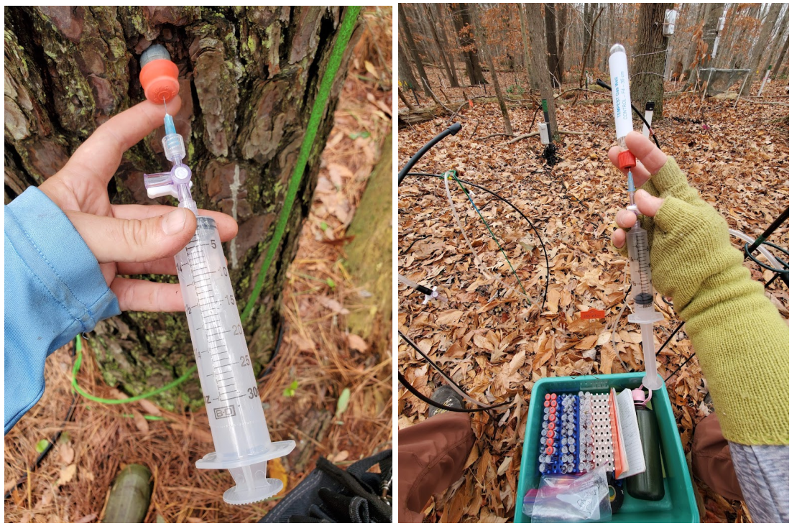
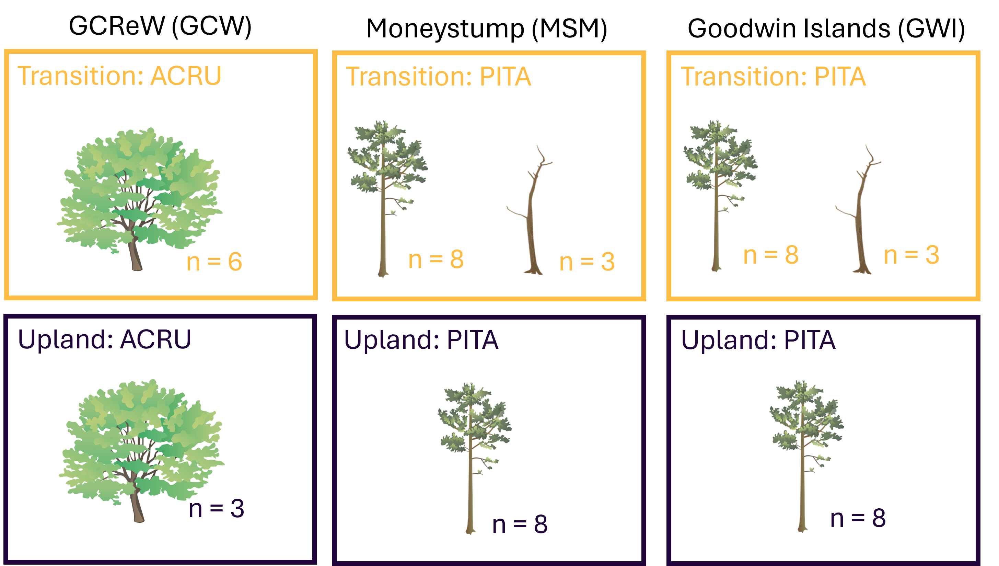

**Project: COMPASS - Synoptic Chesapeake Bay** 

Data Type: Tree Gas Well GHGs (TGAS)

Sampling Type: Greenhouse gas concentrations

Sampling Locations: COMPASS Synoptic Sites: MSM, GWI, GCW Trees

 

Wilson S ; Stearns A ; Phillips E ; Ward N D ; Megonigal J P (2025): COMPASS-FME Synoptic Site Tree Greenhouse Gas Concentrations. COMPASS-FME, ESS-DIVE repository. Dataset. doi:10.15485/2588615 accessed via https://data.ess-dive.lbl.gov/datasets/doi:10.15485/2588615.

 

**Data Description:** 
These data are tree stem greenhouse gas concentrations collected from tree gas wells at some of the COMPASS 'synoptic' sites in the Chesapeake Bay region: Moneystump (MSM), Goodwin Islands (GWI), and GCReW (GCW). The sap flow monitoring trees at these sites in the Upland (UP) and Transition (TR) zones were cored and had gas wells installed at breast height. There were also some dead standing trees cored, gas well installed, and sampled at MSM and GWI. The GCW UP samples overlap with the TEMPEST experiment control plot, so the GCW UP data was pulled from the TEMPEST page and included here. These data provide crucial information about possible pathways for the greenhouse gas ( CO2 and CH4) production and emission (or in the case of CH4, perhaps taken up from) the atmosphere. The samples were stored in exetainers then analyzed for methane and carbon dioxide on a Varian 450 Gas   Chromatograph. The methane is determined with an FID and the carbon dioxide with a TCD. 

 

Gas samples were collected roughly from May to November at each site during 2022 and 2023. Sampling these wells was discontinued in 2024. 

Samples were labeled as:  SiteCode_SampleType_Zone_TreeType_Replicate (ex. GCW_TGW_TR_SF_1) 

For questions about this data: contact Stephanie J. Wilson (wilsonsj@si.edu) or Patrick Megonigal (megonigalp@si.edu). 

 

  

 

**Data Files Available:** 

"COMPASS_SynopticCB_TGAS_AllData.csv" = All data from all years.QAQC'd and collated.

"COMPASS_SynopticCB_TGAS_Metadata.csv" = Metadata for AllData file that explains each column header, units, and instrumentation.
  

